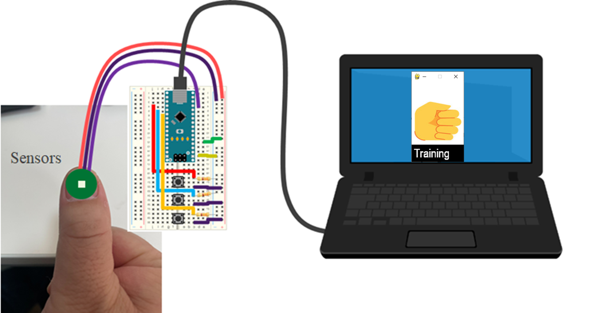
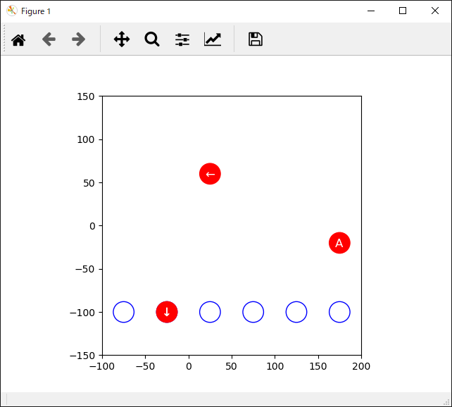
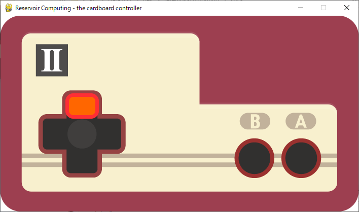
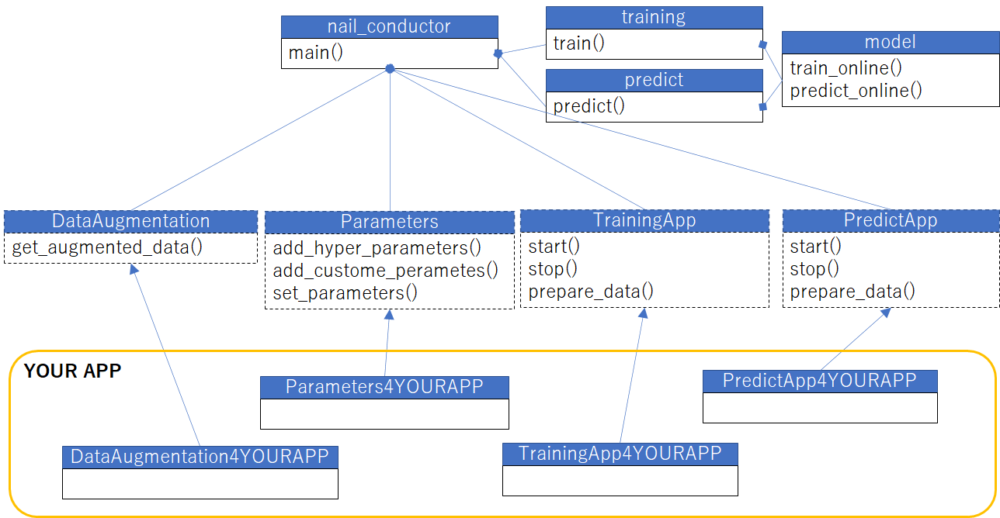
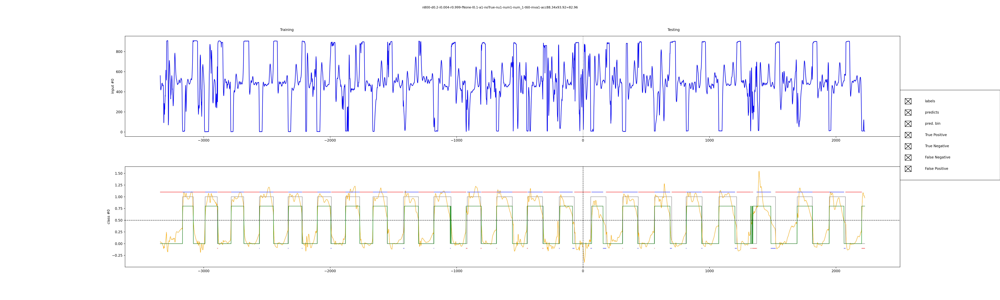

# reservoir-computing

## Real time training and predict framework
This program is a framework of reservoir-computing that adopts multiple applications.
It runs on basically PC(Ubuntu).

You might need to implement codes on a device like arduino for getting data from sensors. 

Here is a sample code which runs on arduino for 4 sensors and 3 buttons. You can custom it for your applications.

[puls_sensors_sample.ino](https://github.com/recruit-tech/reservoir-computing/blob/master/src/arduino/puls_sensors_sample/puls_sensors_sample.ino)




### Usage

how to run a thumup detection with reservoir-computing
 ```
git clone https://github.com/recruit-tech/reservoir-computing.git
cd reservoir-computing/src
python nail_conductor.py
 ```

To quit the program, push [q] key on the screen or ctrl + c on the terminal.

You can also run a cardboard controller( famicom ) when you change code as follows in [.env](https://github.com/recruit-tech/reservoir-computing/blob/master/src/.env)

 ```
#APPLICATION_NAME=app_thumbup
APPLICATION_NAME=app_famicom
#APPLICATION_NAME=app_balloon
#APPLICATION_NAME=app_volume
 ```

You will see the following images. (upper:training screen, lower: predict screen)




### How to make YOUR APPs.
If you would like to make YOUR APPs, you only need to write 4 claasses which is in the orange frame on folliwing diagram.



***

## Batch training and predict framework
[batch_training_and_predict.py](https://github.com/recruit-tech/reservoir-computing/blob/master/src/batch_training_and_predict.py) is batch program which train and predict and outputs a figure as follow.




### Usage

how to run the batch program for thumup detection.
 ```
cd reservoir-computing/src
python batch_training_and_predict.py -csv_file output/train_log_20221101_115348.csv
 ```


***

## Grid search for finding the best hyper parameters 
[grid_search.py](https://github.com/recruit-tech/reservoir-computing/blob/master/src/grid_search.py) is program which find the best hyper parameters.


### Usage

how to run a sample program for grid search.
 ```
cd reservoir-computing/src
python grid_search.py -csv_file output/thumbup_nc_data.csv

### Setting scope of hyper parameters.
Please find set_next_grid_search_params() in [app_thumbup_new.py](https://github.com/recruit-tech/reservoir-computing/blob/master/src/app_thumbup_new.py) for reference.

