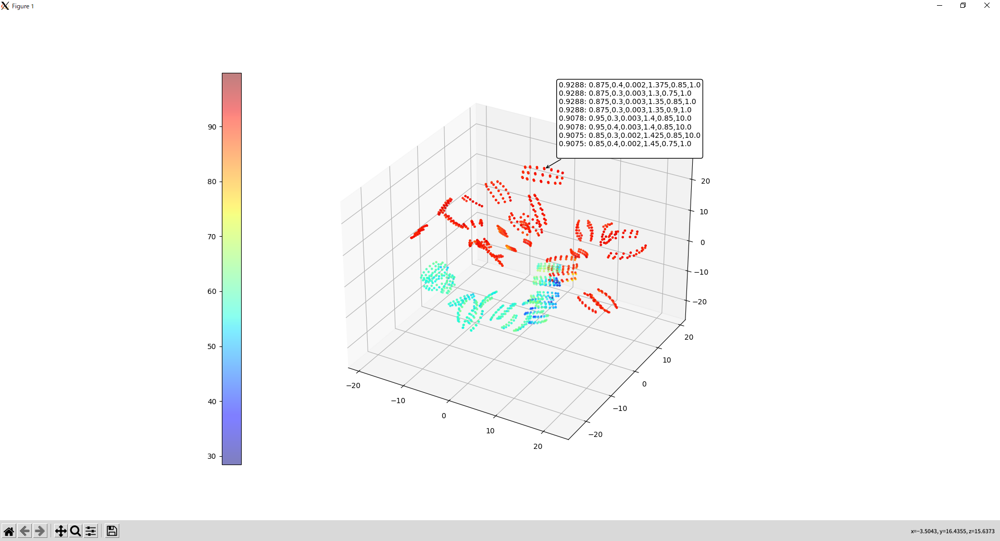

# reservoir-computing

## Real time training and predict framework
This program is a framework of reservoir-computing that adopts multiple applications.
It runs on basically PC(Ubuntu).

You might need to implement codes on a device like arduino for getting data from sensors. 

Here is a sample code which runs on arduino for 4 sensors and 3 buttons. You can custom it for your applications.

[puls_sensors_sample.ino](https://github.com/recruit-tech/reservoir-computing/blob/master/src/arduino/puls_sensors_sample/puls_sensors_sample.ino)


### Usage

At first, you need to change the com port according to your environment in [nail_conductor.py](https://github.com/recruit-tech/reservoir-computing/blob/master/src/nail_conductor.py)

 ```
    # Set com port as data streamer
    ds = data_streamer_serial.DataStreamer('COM3') # 
 ```


how to run a thumup detection with reservoir-computing
 ```
git clone https://github.com/recruit-tech/reservoir-computing.git
cd reservoir-computing/src
python nail_conductor.py
 ```

To quit the program, push [q] key on the screen or ctrl + c on the terminal.

You can also run a cardboard controller( famicom ) when you change code as follows in [.env](https://github.com/recruit-tech/reservoir-computing/blob/master/src/.env)

 ```
#APPLICATION_NAME=app_thumbup
APPLICATION_NAME=app_famicom
#APPLICATION_NAME=app_balloon
#APPLICATION_NAME=app_volume
 ```

You will see the following images. (upper:training screen, lower: predict screen)


### How to make YOUR APPs.
If you would like to make YOUR APPs, you only need to write 4 claasses which is in the orange frame on folliwing diagram.


***

## Batch training and predict framework
[batch_training_and_predict.py](https://github.com/recruit-tech/reservoir-computing/blob/master/src/batch_training_and_predict.py) is batch program which train and predict and outputs a figure as follow.


### Usage

how to run the batch program for thumup detection.
 ```
cd reservoir-computing/src
python batch_training_and_predict.py -csv_file output/train_log_20221101_115348.csv
 ```


***

## Grid search for finding the best hyper parameters 
[grid_search.py](https://github.com/recruit-tech/reservoir-computing/blob/master/src/grid_search.py) is program which finds the best hyper parameters.


### Usage

First of all, you need to change application to thumup_new as follows in [.env](https://github.com/recruit-tech/reservoir-computing/blob/master/src/.env)

 ```
APPLICATION_NAME=app_thumbup_new
 ```

And then, run a sample program for grid search.
 ```
cd reservoir-computing/src
python grid_search.py -csv_file output/thumbup_nc_data.csv -cpu 4
 ```

### Setting scope of hyper parameters.
Please find set_next_grid_search_params() in [app_thumbup_new.py](https://github.com/recruit-tech/reservoir-computing/blob/master/src/app_thumbup_new.py) for reference.
All you need is change following code if you'd like to change the range of hyper parameters.
 ```
    def set_next_grid_search_params(self):
                :
            for node in [800,900,1000]:
                for density in [0.4,]:
                    for input_scale in [0.004,]:
                        for rho in [0.6,0.7,0.8,0.9,1.0]:
                            for fb_scale in [None,]:
                                for leaking_rate in [0.1,]:
                                    for average_window in [1,]:
                :
        return True
 ```


### Visualization the result of relationship between accuracy and hyperparameters with T-SNE.


 ```
python t_sne.py -csv_file output/results_grid_search_app_thumbup_new_2736.csv
 ```

You will see the following chart.




***

## Arduino
### arduino code for app_thumbup_new or two nail conductor devices. 
[nc_3input_with_sw.ino](https://github.com/recruit-tech/reservoir-computing/blob/master/src/arduino/nc_3input_with_sw/nc_3input_with_sw.ino) is a single nail conductor device. Supports button annotation.
[nc_6input.ino](https://github.com/recruit-tech/reservoir-computing/blob/master/src/arduino/nc_6input/nc_6input.ino) is two nail conductor devices(6 pd inputs) without button.

#### nc_3input_with_sw
analog pin No. 0, 1, 2 (sensor input)  
digital pin No. 2 (switch button）→ No resistor required (this is setting a pullup)

#### nc_6input
analog pin No. 0, 1, 2, 3, 4, 5 (sensor input)
